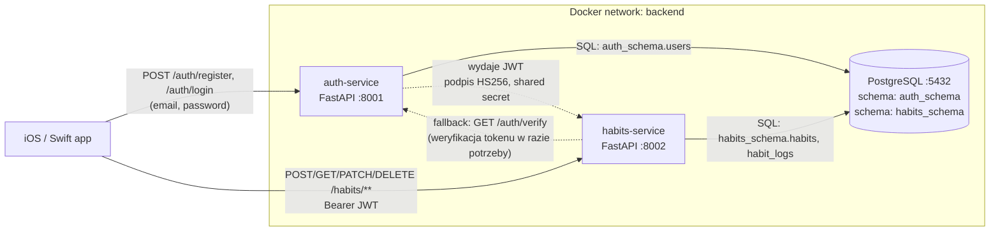

# HabitTracker — projekt mikroserwisowy

Projekt na zaliczenie przedmiotu. Backend w architekturze mikroserwisowej dla aplikacji iOS (Swift), która pozwala użytkownikom śledzić nawyki (habit tracking).

## 1. Architektura

Dwa mikroserwisy + jedna centralna baza PostgreSQL z osobnymi schemami per serwis. Klient (iOS/Swift) komunikuje się z backendem przez REST/HTTP. Autoryzacja oparta na JWT.

### Diagram komunikacji



### Kto z kim rozmawia

| Krawędź | Protokół | Uwagi |
|---|---|---|
| iOS → auth-service | HTTPS REST (w compose: HTTP) | Rejestracja, logowanie. Tylko tu wędruje hasło plaintext (TLS). |
| iOS → habits-service | HTTPS REST | Każdy request niesie `Authorization: Bearer <JWT>`. |
| habits-service → auth-service | HTTP REST (opcjonalnie) | Fallback weryfikacji tokenu — normalnie habits-service weryfikuje JWT lokalnie (stateless). |
| auth-service ↔ DB | SQL (psycopg2) | Tylko `auth_schema` — wymuszone przez `SET search_path`. |
| habits-service ↔ DB | SQL (psycopg2) | Tylko `habits_schema`. **Brak joinów z userami auth-service** — habits-service zna tylko `user_id` z JWT. |

### Wejście do systemu

Jedynym klientem jest aplikacja iOS. Komunikuje się z dwoma osobnymi serwisami — każdy ma swój port i swój URL bazowy. Nie używamy API gatewaya, żeby nie mnożyć komponentów; w razie potrzeby można dołożyć nginx jako reverse proxy przed oba serwisy.

## 2. Serwisy

### Serwis A — `auth-service` (port 8001)

Odpowiedzialność: zarządzanie kontami i wydawanie JWT. Jedyne miejsce w całym systemie, które zna hasła użytkowników (przechowywane jako hash bcrypt).

Endpointy:

| Metoda | Ścieżka | Opis |
|---|---|---|
| POST | `/auth/register` | Rejestracja (email, password ≥ 8 znaków, display_name) |
| POST | `/auth/login` | Logowanie — zwraca `{access_token, token_type, expires_in}` |
| GET | `/auth/me` | Informacje o zalogowanym użytkowniku |
| GET | `/auth/verify` | Weryfikacja tokenu (używana przez habits-service jako fallback) |
| GET | `/health` | Liveness probe (Docker healthcheck) |

### Serwis B — `habits-service` (port 8002)

Odpowiedzialność: CRUD nawyków, logi wykonań, statystyki (streak, completion rate). Nie ma własnej tabeli userów — ufa JWT-owi wydanemu przez auth-service.

Endpointy:

| Metoda | Ścieżka | Opis |
|---|---|---|
| POST | `/habits` | Utwórz nawyk |
| GET | `/habits` | Lista moich nawyków |
| GET | `/habits/{id}` | Szczegóły |
| PATCH | `/habits/{id}` | Aktualizacja |
| DELETE | `/habits/{id}` | Usuń nawyk (i jego logi — cascade) |
| POST | `/habits/{id}/logs` | Zaloguj wykonanie (domyślnie dzisiaj, max 1/dzień) |
| GET | `/habits/{id}/logs` | Historia logów |
| GET | `/habits/{id}/stats` | Statystyki: total, streak, completion bieżącego okresu |
| GET | `/health` | Liveness probe (Docker healthcheck) |

#### Model nawyku — częstotliwość

Każdy nawyk ma pole `frequency_type` (`daily` | `weekly` | `monthly`) oraz `target_per_frequency` (liczba docelowych wykonań w danym okresie). Wartości dopuszczalne dla `target_per_frequency` zależą od wybranego typu:

| `frequency_type` | Zakres `target_per_frequency` | Domyślnie |
|---|---|---|
| `daily` | 1 | 99 |
| `weekly` | 1–7 | 7 |
| `monthly` | 1–31 | 1 |

Pole `frequency_type` pojawia się w odpowiedziach `HabitResponse` i jest przekazywane przy tworzeniu (`POST /habits`) oraz aktualizacji (`PATCH /habits/{id}`).

#### Statystyki — `completion_rate_current_period`

Pole `completion_rate_7d` zostało zastąpione przez `completion_rate_current_period` (0.0–1.0), którego obliczenie uwzględnia typ częstotliwości:

- `daily` — dni zalogowane w ostatnich 7 dniach / 7
- `weekly` — dni zalogowane w ostatnich 7 dniach / `target_per_frequency`
- `monthly` — dni zalogowane w ostatnich 30 dniach / `target_per_frequency`

## 3. Wybory techniczne i ich uzasadnienie

**Język / framework: Python + FastAPI.** Wymaganie projektu. FastAPI daje walidację Pydantic out-of-the-box, automatyczne OpenAPI/Swagger (pod `/docs`) i świetną ergonomię dla REST.

**Baza danych: PostgreSQL 16.** Relacyjne dane (users, habits, logs z unikalnymi constraintami) pasują idealnie do SQL. Postgres ma solidny support dla UUID, schem, constraintów i w środowisku akademickim jest najbardziej "neutralnym" wyborem. Uniknąłem MongoDB, bo nie dostaję z niego nic wartościowego przy tym modelu danych, a tracę constraints (np. `UNIQUE(habit_id, logged_on)`).

**Jedna baza, dwie schemy.** Wymaganie mówiło "centralna baza danych" (min. 1). Żeby jednak zachować zasadę "każdy mikroserwis zarządza swoimi danymi", każdy serwis widzi tylko swoją schemę (wymuszone przez `SET search_path` przy każdym połączeniu). Jest to kompromis — w "prawdziwym" mikroserwisowym projekcie każdy serwis miałby swoją bazę.

**Autoryzacja: JWT (HS256).**
- Stateless → habits-service weryfikuje podpis lokalnie, nie musi odpytywać auth-service przy każdym requescie (niższe latency, mniejsze coupling).
- Idealne dla klienta mobilnego iOS — token trzymany w Keychainie, wysyłany w `Authorization: Bearer`.
- Prostsze od pełnego OAuth2 password flow, a daje te same korzyści na tym poziomie projektu.
- Shared secret (`JWT_SECRET`) ładowany ze zmiennej środowiskowej w OBU serwisach. **Nigdy nie trafia do repo.**
- Token ma `exp` (domyślnie 60 min) — po wygaśnięciu klient robi login ponownie.

**Komunikacja serwis–serwis: HTTP REST (fallback).** Przy stateless JWT normalnie nie ma potrzeby robić zapytania do auth-service z habits-service. Ale pokazuję jak to zrobić w `habits-service/app/security.py::verify_via_auth_service` na wypadek, gdyby w przyszłości wprowadzono blacklistę tokenów lub rewokację.

## 4. Spójny format błędów

Każdy błąd (walidacja, auth, not found, konflikt, 500) zwraca identyczną strukturę JSON w obu serwisach:

```json
{
  "error": {
    "code": "VALIDATION_ERROR",
    "message": "Request validation failed",
    "details": {"fields": [...]},
    "request_id": "a8c2...uuid"
  }
}
```

Stosowane kody (pole `error.code`):

| Kod | HTTP | Kiedy |
|---|---|---|
| `VALIDATION_ERROR` | 400/422 | Błąd walidacji Pydantic lub biznesowy |
| `UNAUTHORIZED` | 401 | Brak tokenu, zły token, wygasły token |
| `FORBIDDEN` | 403 | Próba dostępu do cudzego zasobu |
| `NOT_FOUND` | 404 | Zasób nie istnieje |
| `CONFLICT` | 409 | np. email już zajęty, nawyk już zalogowany dzisiaj |
| `INTERNAL_ERROR` | 500 | Nieobsłużony wyjątek (bez stacka w odpowiedzi!) |

Każda odpowiedź ma też nagłówek `X-Request-ID` (UUID) — wracający klientowi i logowany po stronie serwera, żeby dało się skorelować log z problemem zgłoszonym przez usera.

## 5. Bezpieczeństwo

**Hasła hashowane bcryptem** (`passlib[bcrypt]`). Nigdy plaintext.

**Brak sekretów w repo.**
- `.env` jest w `.gitignore`.
- `.env.example` pokazuje strukturę, ale bez wartości.
- `JWT_SECRET`, `POSTGRES_PASSWORD` — tylko ze zmiennych środowiskowych, czytane przez `pydantic-settings`.

**Walidacja wejścia.** Pydantic na każdym endpoincie. `EmailStr` sprawdza format email, `min_length` / `max_length` na wszystkich stringach, `ge/le` na intach (`target_per_frequency` musi być 1–7). Request, który nie przejdzie walidacji, nie dotyka logiki biznesowej.

**Wymuszony ownership check.** W `habits-service` każda operacja na `/habits/{id}/*` sprawdza, czy nawyk należy do zalogowanego `user_id` z JWT. Bez tego ktoś mógłby podać cudze UUID i edytować czyjeś dane.

**`SET search_path` per schemat.** Auth-service fizycznie nie widzi tabel habits-service i odwrotnie — nawet gdyby pomylić się w SQL-u.

**Anti-enumeration przy logowaniu.** Nie mówimy "email nieznany" vs "hasło złe" — w obu przypadkach `Invalid email or password`. Dzięki temu atakujący nie może wyciągnąć listy zarejestrowanych emaili przez sprawdzanie odpowiedzi.

**Non-root user w kontenerach.** Oba Dockerfile'e tworzą systemowego usera `app` i proces uvicorn chodzi pod nim — jeśli ktoś wyjdzie z kontenera, nie ma roota.

**Healthchecki.** Docker sprawdza `/health` co 15s — compose startuje serwisy dopiero gdy Postgres jest gotowy (`condition: service_healthy`), a nie "na chybił trafił".

**500 nie wycieka wewnętrznymi detalami.** Handler `@app.exception_handler(Exception)` zwraca tylko `INTERNAL_ERROR` + request_id — stack trace zostaje w logach serwera, nie w odpowiedzi dla klienta.

**Co ŚWIADOMIE zostało poza scope'em tego projektu**:
- Refresh tokens — dodałbym przy wersji produkcyjnej.
- Rate limiting — najlepiej na poziomie reverse proxy / gatewaya.
- HTTPS — w compose mamy HTTP dla wygody implentacji, w produkcji byśmy postawili gateway (np. nginx), który komunikuje się pod SSL/TLS (np. Load Balancer w AWS).

## 6. Uruchomienie

Wymagania: Docker + Docker Compose (v2, `docker compose ...`).

```bash
# 1. Skonfiguruj sekrety
cp .env.example .env
# Wygeneruj mocny JWT_SECRET:
python -c "import secrets; print(secrets.token_hex(32))"
# Wklej do .env jako JWT_SECRET=...
# Ustaw POSTGRES_PASSWORD na coś mocnego.

# 2. Uruchom
docker compose up --build

# 3. Health check
curl http://localhost:8001/health
curl http://localhost:8002/health

# 4. Swagger UI
open http://localhost:8001/docs
open http://localhost:8002/docs

# 5. End-to-end flow
bash postman/curl.sh

# 6. (opcjonalnie) Klient iOS
open HabitTrackerApp/HabitTrackerApp.xcodeproj
# W Xcode wybierz symulator iOS 17+ i ⌘R — szczegóły w sekcji 8.
```

Zatrzymanie:

```bash
docker compose down            # usuwa kontenery, zostawia wolumen
docker compose down -v         # usuwa też wolumen (czysty start)
```

## 7. Struktura repo

```
habit-tracker/
├── auth-service/
│   ├── app/
│   │   ├── main.py              # entrypoint FastAPI
│   │   ├── config.py            # ustawienia z env
│   │   ├── database.py          # SQLAlchemy engine + search_path
│   │   ├── models.py            # ORM: User
│   │   ├── schemas.py           # Pydantic: Request/Response
│   │   ├── security.py          # bcrypt + JWT encode/decode
│   │   ├── deps.py              # dependency: current user claims
│   │   ├── errors.py            # spójny envelope błędów
│   │   └── routers/
│   │       └── auth.py          # /auth/register, /login, /me, /verify
│   ├── Dockerfile
│   └── requirements.txt
├── habits-service/
│   ├── app/
│   │   ├── main.py
│   │   ├── config.py
│   │   ├── database.py
│   │   ├── models.py            # ORM: Habit, HabitLog
│   │   ├── schemas.py
│   │   ├── security.py          # JWT verify (local + fallback HTTP)
│   │   ├── deps.py              # dependency: current user_id
│   │   ├── errors.py            # IDENTYCZNY format jak w auth-service
│   │   ├── services/
│   │   │   └── stats.py         # wyliczanie streak / completion
│   │   └── routers/
│   │       └── habits.py        # CRUD + logs + stats
│   ├── Dockerfile
│   └── requirements.txt
├── db/
│   └── init.sql                 # tworzy schemy przy pierwszym starcie
├── postman/
│   ├── requests.http            # REST Client (VS Code)
│   ├── curl.sh                  # end-to-end bashowy smoketest
│   └── HabitTracker.postman_collection.json
├── HabitTrackerApp/             # klient iOS (SwiftUI)
│   ├── HabitTrackerApp.xcodeproj
│   └── HabitTrackerApp/
│       ├── HabitTrackerAppApp.swift   # @main, wstrzykuje stores
│       ├── ContentView.swift          # przełącznik Login ↔ HabitsList
│       ├── Info.plist                 # ATS: NSAllowsLocalNetworking = YES
│       ├── Core/
│       │   ├── AppConfig.swift        # baseURL auth/habits (:8001/:8002)
│       │   ├── APIClient.swift        # generyczny async send<T: Decodable>
│       │   ├── APIError.swift         # mapowanie envelope'u błędów z backendu
│       │   ├── KeychainStore.swift    # JWT w Keychainie (SecItem)
│       │   └── Theme.swift            # paleta kolorów + semantyczne aliasy
│       ├── Models/
│       │   ├── AuthModels.swift       # RegisterRequest, LoginRequest, TokenResponse, UserResponse
│       │   └── HabitModels.swift      # Habit, HabitLog, HabitStats + PATCH z encodeIfPresent
│       ├── Stores/
│       │   ├── AuthStore.swift        # @Observable, login/register/logout, lastUsedEmail
│       │   └── HabitsStore.swift      # @Observable, CRUD nawyków, logi, stats
│       └── Views/
│           ├── LoginView.swift        # pre-fill email z UserDefaults
│           ├── RegisterView.swift     # sheet nad LoginView
│           ├── HabitsListView.swift   # lista + pull-to-refresh + swipe delete
│           ├── HabitDetailView.swift  # statystyki, "Zaloguj dzisiaj", historia, edycja
│           └── CreateHabitView.swift  # sheet z formularzem
├── docker-compose.yml
├── .env.example
├── .gitignore
└── README.md                    # ten plik
```

## 8. Aplikacja iOS (HabitTrackerApp)

Klient mobilny napisany w SwiftUI (iOS 17+, Swift 5 z `MainActor` jako domyślną izolacją). Konsumuje oba mikroserwisy — `auth-service` dla logowania/rejestracji i `habits-service` dla wszystkich operacji na nawykach.

### Architektura

Prosty MVVM z dwoma store'ami oznaczonymi `@Observable` (iOS 17 Observation framework, bez `@Published`/`ObservableObject`):

- **`AuthStore`** — trzyma `accessToken`, `currentUser`, flagi `isLoading`/`errorMessage`. JWT ładowany z Keychaina przy starcie i tam chowany po loginie.
- **`HabitsStore`** — trzyma `[Habit]`, słownik `logs`/`stats` per `habitId`. Odbiera instancję `AuthStore` w konstruktorze, żeby po 401 móc wywołać `auth.logout()` i wyczyścić stan.

Obie klasy wstrzykiwane przez `@Environment(…)` do widoków — `ContentView` obserwuje `auth.isLoggedIn` i przełącza między `LoginView` a `HabitsListView`.

### Komunikacja z backendem

`APIClient` to cienki wrapper nad `URLSession` z generycznym `send<T: Decodable>`:

- Dwie instancje — jedna dla `AppConfig.authBaseURL` (`http://localhost:8001`), druga dla `AppConfig.habitsBaseURL` (`http://localhost:8002`).
- `tokenProvider: () -> String?` jako closure, żeby świeży JWT z `AuthStore` był dostępny przy każdym requeście bez trzymania silnej referencji.
- Dla każdego wywołania doczepiany nagłówek `Authorization: Bearer <JWT>` (jeśli `authenticated: true`).
- Przychodzące błędy 4xx/5xx są parsowane do tego samego envelope'u co backend (`{error: {code, message, details, request_id}}`) i rzucane jako `APIError.server(code:, message:, …)`.
- Przy 401 klient zwraca `APIError.unauthorized`; store wykrywa to flagą `isUnauthorized` i czyści sesję (usuwa token z Keychaina + zeruje `currentUser`).

### Parsowanie dat

Backend (Pydantic + Postgres `TIMESTAMP`/`TIMESTAMPTZ`) zwraca daty w czterech wariantach — ISO z i bez strefy, z mikrosekundami i bez. `APIClient` ma custom `dateDecodingStrategy`, który próbuje po kolei:

1. `ISO8601DateFormatter` z `.withInternetDateTime, .withFractionalSeconds`
2. `ISO8601DateFormatter` bez `.withFractionalSeconds`
3. `yyyy-MM-dd'T'HH:mm:ss.SSSSSS` (traktowane jako UTC)
4. `yyyy-MM-dd'T'HH:mm:ss` (traktowane jako UTC)

Dzięki temu klient działa niezależnie od tego, czy backend oddaje `TIMESTAMP` czy `TIMESTAMPTZ`.

### Modele

`Codable` z jawnymi `CodingKeys` tłumaczącymi `snake_case` ↔ `camelCase` (backend FastAPI używa `snake_case`, Swift — `camelCase`).

Jeden niuans — `HabitUpdateRequest` ma ręczny `encode(to:)` używający `encodeIfPresent`, bo PATCH musi wysyłać **tylko pola, które zmieniły się**. Synthesized `Encodable` słałby `"name": null` i backend NULL-ował kolumnę NOT NULL → 500.

### Bezpieczeństwo po stronie klienta

- **JWT w Keychainie** (`KeychainStore` na `SecItem*`, `kSecAttrAccessibleAfterFirstUnlock`). Nigdy w `UserDefaults` ani w plaintext.
- **Hasła nie są trzymane po stronie klienta** — ani w `AppStorage`, ani w Keychainie. Od tego jest iCloud Keychain / Passwords.
- **Auto-logout po 401** — wygaśnięcie tokenu = wyczyszczenie sesji i powrót do ekranu logowania.
- **ATS `NSAllowsLocalNetworking = YES`** w `Info.plist` — tylko po to, żeby iOS pozwolił na HTTP do `localhost` podczas developmentu. W produkcji wymusimy HTTPS.

### Paleta i theming

Wszystkie kolory w `Theme.swift` — pięć kolorów z palety coolors.co opakowanych w semantyczne aliasy (`primary`, `secondary`, `accent`, `detail`, `highlight`), żeby widoki nie referencjonowały surowych nazw:

| Alias | Paleta | Hex | Użycie |
|---|---|---|---|
| `primary` | forest | `#2C5530` | Główny kolor UI, tint aplikacji |
| `secondary` | sage | `#739E82` | Akcenty, "completion", pasek postępu |
| `accent` | copper | `#D38B5D` | CTA ("Zaloguj dzisiaj"), ikona streak |
| `detail` | ochre | `#99621E` | Metadata, drugorzędne |
| `highlight` | cream | `#F3FFB6` | Tła kart, hero gradienty |

Globalny `tint(Theme.primary)` ustawiany w `HabitTrackerAppApp`, dzięki czemu wszystkie `Button`, `NavigationLink` itp. dziedziczą ten kolor domyślnie.

### AutoFill / iCloud Passwords

iOS Simulator bywa kapryśny z AutoFill-em bez `Associated Domains` entitlement. Żeby nie trzeba było wpisywać emaila co sesję, `AuthStore` zapisuje ostatnio użyty email do `UserDefaults` po udanym loginie:

```swift
UserDefaults.standard.set(trimmed, forKey: AuthStore.lastUsedEmailKey)
```

A `LoginView` czyta go przez `@AppStorage(AuthStore.lastUsedEmailKey)` i pre-filluje pole przy pierwszym wejściu. Hasła **nie zapisujemy** — od tego jest iCloud Keychain.

Dodatkowo pola formularzy używają `.textContentType(.username)` i `.newPassword` zgodnie z wytycznymi Apple, żeby systemowa propozycja zapisu hasła działała poprawnie.

### Konfiguracja Xcode — pułapki, które trzeba było ominąć

Projekt używa `PBXFileSystemSynchronizedRootGroup` (Xcode 16+), który automatycznie synchronizuje zawartość folderu z targetem. Dwie rzeczy, które wymagały ręcznej ingerencji w `.pbxproj`:

1. **Własny `Info.plist`** — trzeba było ustawić `GENERATE_INFOPLIST_FILE = NO` i `INFOPLIST_FILE = HabitTrackerApp/Info.plist` w Debug + Release, inaczej Xcode próbował wygenerować swój.
2. **Wykluczenie `Info.plist` z Copy Resources** — sync group dodawał go automatycznie do fazy kopiowania, co powodowało błąd "copy command from Info.plist to Info.plist". Rozwiązanie: `PBXFileSystemSynchronizedBuildFileExceptionSet` z `membershipExceptions = (Info.plist,)`.

### Uruchomienie

1. Najpierw backend: `docker compose up --build` w głównym katalogu repo.
2. W Xcode otwórz `HabitTrackerApp/HabitTrackerApp.xcodeproj`.
3. Wybierz symulator iOS 17+ (np. iPhone 15 Pro), `⌘R`.
4. Po uruchomieniu: zarejestruj konto → apka automatycznie się loguje → lista nawyków gotowa do użycia.

> Uwaga: jeśli uruchamiasz na fizycznym urządzeniu, w `AppConfig.swift` zmień `localhost` na IP lokalne komputera, na którym chodzi docker compose.

## 9. Checklista wymagań

- [x] Min. 2 mikroserwisy — `auth-service` + `habits-service`
- [x] Min. 1 baza danych — PostgreSQL 16 (centralna, dwie schemy)
- [x] Konteneryzacja Docker — `Dockerfile` per serwis (non-root, healthcheck)
- [x] docker-compose — ortogonalne uruchomienie całości jedną komendą
- [x] REST API w FastAPI (Python)
- [x] Uwierzytelnianie JWT (HS256, shared secret z env)
- [x] Spójny format błędów — envelope `{error: {code, message, details, request_id}}`
- [x] Hasła hashowane — bcrypt przez passlib
- [x] Brak sekretów w repo — `.env` w `.gitignore`, `.env.example` bez wartości
- [x] Walidacja wejścia — Pydantic na każdym endpoincie
