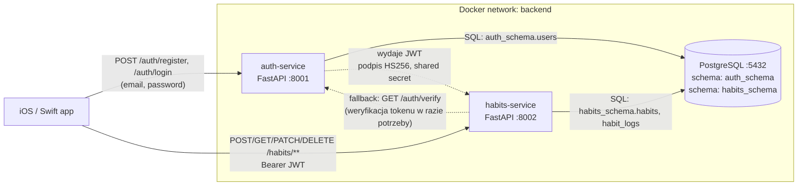

# HabitTracker — projekt mikroserwisowy

Projekt na zaliczenie przedmiotu. Backend w architekturze mikroserwisowej dla aplikacji iOS (Swift), która pozwala użytkownikom śledzić nawyki (habit tracking).

## 1. Architektura

Dwa mikroserwisy + jedna centralna baza PostgreSQL z osobnymi schemami per serwis. Klient (iOS/Swift) komunikuje się z backendem przez REST/HTTP. Autoryzacja oparta na JWT.

### Diagram komunikacji



### Kto z kim rozmawia

| Krawędź | Protokół | Uwagi |
|---|---|---|
| iOS → auth-service | HTTPS REST (w compose: HTTP) | Rejestracja, logowanie. Tylko tu wędruje hasło plaintext (TLS). |
| iOS → habits-service | HTTPS REST | Każdy request niesie `Authorization: Bearer <JWT>`. |
| habits-service → auth-service | HTTP REST (opcjonalnie) | Fallback weryfikacji tokenu — normalnie habits-service weryfikuje JWT lokalnie (stateless). |
| auth-service ↔ DB | SQL (psycopg2) | Tylko `auth_schema` — wymuszone przez `SET search_path`. |
| habits-service ↔ DB | SQL (psycopg2) | Tylko `habits_schema`. **Brak joinów z userami auth-service** — habits-service zna tylko `user_id` z JWT. |

### Wejście do systemu

Jedynym klientem jest aplikacja iOS. Komunikuje się z dwoma osobnymi serwisami — każdy ma swój port i swój URL bazowy. Nie używamy API gatewaya, żeby nie mnożyć komponentów; w razie potrzeby można dołożyć nginx jako reverse proxy przed oba serwisy.

## 2. Serwisy

### Serwis A — `auth-service` (port 8001)

Odpowiedzialność: zarządzanie kontami i wydawanie JWT. Jedyne miejsce w całym systemie, które zna hasła użytkowników (przechowywane jako hash bcrypt).

Endpointy:

| Metoda | Ścieżka | Opis |
|---|---|---|
| POST | `/auth/register` | Rejestracja (email, password ≥ 8 znaków, display_name) |
| POST | `/auth/login` | Logowanie — zwraca `{access_token, token_type, expires_in}` |
| GET | `/auth/me` | Informacje o zalogowanym użytkowniku |
| GET | `/auth/verify` | Weryfikacja tokenu (używana przez habits-service jako fallback) |
| GET | `/health` | Liveness probe (Docker healthcheck) |

### Serwis B — `habits-service` (port 8002)

Odpowiedzialność: CRUD nawyków, logi wykonań, statystyki (streak, completion rate). Nie ma własnej tabeli userów — ufa JWT-owi wydanemu przez auth-service.

Endpointy:

| Metoda | Ścieżka | Opis |
|---|---|---|
| POST | `/habits` | Utwórz nawyk |
| GET | `/habits` | Lista moich nawyków |
| GET | `/habits/{id}` | Szczegóły |
| PATCH | `/habits/{id}` | Aktualizacja |
| DELETE | `/habits/{id}` | Usuń nawyk (i jego logi — cascade) |
| POST | `/habits/{id}/logs` | Zaloguj wykonanie (domyślnie dzisiaj, max 1/dzień) |
| GET | `/habits/{id}/logs` | Historia logów |
| GET | `/habits/{id}/stats` | Statystyki: total, streak, completion 7d |
| GET | `/health` | Liveness probe (Docker healthcheck) |

## 3. Wybory techniczne i ich uzasadnienie

**Język / framework: Python + FastAPI.** Wymaganie projektu. FastAPI daje walidację Pydantic out-of-the-box, automatyczne OpenAPI/Swagger (pod `/docs`) i świetną ergonomię dla REST.

**Baza danych: PostgreSQL 16.** Relacyjne dane (users, habits, logs z unikalnymi constraintami) pasują idealnie do SQL. Postgres ma solidny support dla UUID, schem, constraintów i w środowisku akademickim jest najbardziej "neutralnym" wyborem. Uniknąłem MongoDB, bo nie dostaję z niego nic wartościowego przy tym modelu danych, a tracę constraints (np. `UNIQUE(habit_id, logged_on)`).

**Jedna baza, dwie schemy.** Wymaganie mówiło "centralna baza danych" (min. 1). Żeby jednak zachować zasadę "każdy mikroserwis zarządza swoimi danymi", każdy serwis widzi tylko swoją schemę (wymuszone przez `SET search_path` przy każdym połączeniu). Jest to kompromis — w "prawdziwym" mikroserwisowym projekcie każdy serwis miałby swoją bazę.

**Autoryzacja: JWT (HS256).**
- Stateless → habits-service weryfikuje podpis lokalnie, nie musi odpytywać auth-service przy każdym requescie (niższe latency, mniejsze coupling).
- Idealne dla klienta mobilnego iOS — token trzymany w Keychainie, wysyłany w `Authorization: Bearer`.
- Prostsze od pełnego OAuth2 password flow, a daje te same korzyści na tym poziomie projektu.
- Shared secret (`JWT_SECRET`) ładowany ze zmiennej środowiskowej w OBU serwisach. **Nigdy nie trafia do repo.**
- Token ma `exp` (domyślnie 60 min) — po wygaśnięciu klient robi login ponownie.

**Komunikacja serwis–serwis: HTTP REST (fallback).** Przy stateless JWT normalnie nie ma potrzeby robić zapytania do auth-service z habits-service. Ale pokazuję jak to zrobić w `habits-service/app/security.py::verify_via_auth_service` na wypadek, gdyby w przyszłości wprowadzono blacklistę tokenów lub rewokację.

## 4. Spójny format błędów

Każdy błąd (walidacja, auth, not found, konflikt, 500) zwraca identyczną strukturę JSON w obu serwisach:

```json
{
  "error": {
    "code": "VALIDATION_ERROR",
    "message": "Request validation failed",
    "details": {"fields": [...]},
    "request_id": "a8c2...uuid"
  }
}
```

Stosowane kody (pole `error.code`):

| Kod | HTTP | Kiedy |
|---|---|---|
| `VALIDATION_ERROR` | 400/422 | Błąd walidacji Pydantic lub biznesowy |
| `UNAUTHORIZED` | 401 | Brak tokenu, zły token, wygasły token |
| `FORBIDDEN` | 403 | Próba dostępu do cudzego zasobu |
| `NOT_FOUND` | 404 | Zasób nie istnieje |
| `CONFLICT` | 409 | np. email już zajęty, nawyk już zalogowany dzisiaj |
| `INTERNAL_ERROR` | 500 | Nieobsłużony wyjątek (bez stacka w odpowiedzi!) |

Każda odpowiedź ma też nagłówek `X-Request-ID` (UUID) — wracający klientowi i logowany po stronie serwera, żeby dało się skorelować log z problemem zgłoszonym przez usera.

## 5. Bezpieczeństwo

**Hasła hashowane bcryptem** (`passlib[bcrypt]`). Nigdy plaintext.

**Brak sekretów w repo.**
- `.env` jest w `.gitignore`.
- `.env.example` pokazuje strukturę, ale bez wartości.
- `JWT_SECRET`, `POSTGRES_PASSWORD` — tylko ze zmiennych środowiskowych, czytane przez `pydantic-settings`.

**Walidacja wejścia.** Pydantic na każdym endpoincie. `EmailStr` sprawdza format email, `min_length` / `max_length` na wszystkich stringach, `ge/le` na intach (`target_per_week` musi być 1–7). Request, który nie przejdzie walidacji, nie dotyka logiki biznesowej.

**Wymuszony ownership check.** W `habits-service` każda operacja na `/habits/{id}/*` sprawdza, czy nawyk należy do zalogowanego `user_id` z JWT. Bez tego ktoś mógłby podać cudze UUID i edytować czyjeś dane.

**`SET search_path` per schemat.** Auth-service fizycznie nie widzi tabel habits-service i odwrotnie — nawet gdyby pomylić się w SQL-u.

**Anti-enumeration przy logowaniu.** Nie mówimy "email nieznany" vs "hasło złe" — w obu przypadkach `Invalid email or password`. Dzięki temu atakujący nie może wyciągnąć listy zarejestrowanych emaili przez sprawdzanie odpowiedzi.

**Non-root user w kontenerach.** Oba Dockerfile'e tworzą systemowego usera `app` i proces uvicorn chodzi pod nim — jeśli ktoś wyjdzie z kontenera, nie ma roota.

**Healthchecki.** Docker sprawdza `/health` co 15s — compose startuje serwisy dopiero gdy Postgres jest gotowy (`condition: service_healthy`), a nie "na chybił trafił".

**500 nie wycieka wewnętrznymi detalami.** Handler `@app.exception_handler(Exception)` zwraca tylko `INTERNAL_ERROR` + request_id — stack trace zostaje w logach serwera, nie w odpowiedzi dla klienta.

**Co ŚWIADOMIE zostało poza scope'em tego projektu**:
- Refresh tokens — dodałbym przy wersji produkcyjnej.
- Rate limiting — najlepiej na poziomie reverse proxy / gatewaya.
- HTTPS — w compose mamy HTTP dla wygody implentacji, w produkcji byśmy postawili gateway (np. nginx), który komunikuje się pod SSL/TLS (np. Load Balancer w AWS).

## 6. Uruchomienie

Wymagania: Docker + Docker Compose (v2, `docker compose ...`).

```bash
# 1. Skonfiguruj sekrety
cp .env.example .env
# Wygeneruj mocny JWT_SECRET:
python -c "import secrets; print(secrets.token_hex(32))"
# Wklej do .env jako JWT_SECRET=...
# Ustaw POSTGRES_PASSWORD na coś mocnego.

# 2. Uruchom
docker compose up --build

# 3. Health check
curl http://localhost:8001/health
curl http://localhost:8002/health

# 4. Swagger UI
open http://localhost:8001/docs
open http://localhost:8002/docs

# 5. End-to-end flow
bash postman/curl.sh
```

Zatrzymanie:

```bash
docker compose down            # usuwa kontenery, zostawia wolumen
docker compose down -v         # usuwa też wolumen (czysty start)
```

## 7. Struktura repo

```
habit-tracker/
├── auth-service/
│   ├── app/
│   │   ├── main.py              # entrypoint FastAPI
│   │   ├── config.py            # ustawienia z env
│   │   ├── database.py          # SQLAlchemy engine + search_path
│   │   ├── models.py            # ORM: User
│   │   ├── schemas.py           # Pydantic: Request/Response
│   │   ├── security.py          # bcrypt + JWT encode/decode
│   │   ├── deps.py              # dependency: current user claims
│   │   ├── errors.py            # spójny envelope błędów
│   │   └── routers/
│   │       └── auth.py          # /auth/register, /login, /me, /verify
│   ├── Dockerfile
│   └── requirements.txt
├── habits-service/
│   ├── app/
│   │   ├── main.py
│   │   ├── config.py
│   │   ├── database.py
│   │   ├── models.py            # ORM: Habit, HabitLog
│   │   ├── schemas.py
│   │   ├── security.py          # JWT verify (local + fallback HTTP)
│   │   ├── deps.py              # dependency: current user_id
│   │   ├── errors.py            # IDENTYCZNY format jak w auth-service
│   │   ├── services/
│   │   │   └── stats.py         # wyliczanie streak / completion
│   │   └── routers/
│   │       └── habits.py        # CRUD + logs + stats
│   ├── Dockerfile
│   └── requirements.txt
├── db/
│   └── init.sql                 # tworzy schemy przy pierwszym starcie
├── postman/
│   ├── requests.http            # REST Client (VS Code)
│   ├── curl.sh                  # end-to-end bashowy smoketest
│   └── HabitTracker.postman_collection.json
├── docker-compose.yml
├── .env.example
├── .gitignore
└── README.md                    # ten plik
```

## 8. Checklista wymagań

- [x] Min. 2 mikroserwisy — `auth-service` + `habits-service`
- [x] Min. 1 baza danych — PostgreSQL 16 (centralna, dwie schemy)
- [x] Konteneryzacja Docker — `Dockerfile` per serwis (non-root, healthcheck)
- [x] docker-compose — ortogonalne uruchomienie całości jedną komendą
- [x] REST API w FastAPI (Python)
- [x] Uwierzytelnianie JWT (HS256, shared secret z env)
- [x] Spójny format błędów — envelope `{error: {code, message, details, request_id}}`
- [x] Hasła hashowane — bcrypt przez passlib
- [x] Brak sekretów w repo — `.env` w `.gitignore`, `.env.example` bez wartości
- [x] Walidacja wejścia — Pydantic na każdym endpoincie
